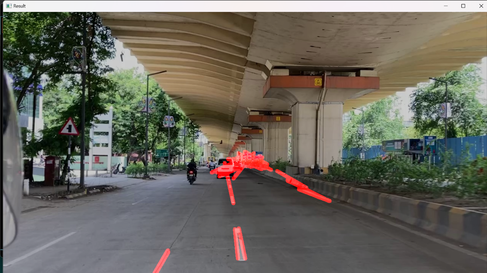

# Vehicle Cut-in Detection

## Overview
Cut-in detection is crucial for advanced driver-assistance systems (ADAS) and autonomous driving. It involves identifying instances where a vehicle abruptly moves into the lane of another vehicle.
Detecting such maneuvers in real-time is essential for maintaining road safety and enabling autonomous vehicles to make informed decisions.

## Features
Data Preprocessing: Tools for preparing and augmenting the dataset.

Model Training: Scripts to train models using various architectures.

Inference: Code to run inference on new data.

Evaluation: Metrics and evaluation scripts to assess model performance.

Visualization: Tools to visualize the results and performance.

## Code and Implementation
### Vehicle Detection- 
#### [vehicle-detection.ipynb](https://github.com/Arya202004/Vehicle-Cut-in-Detection/blob/main/vehicle-detection.ipynb)

### Lane Detection-
#### [lane-detection.py](https://github.com/Arya202004/Vehicle-Cut-in-Detection/blob/main/lane-detection.py)

